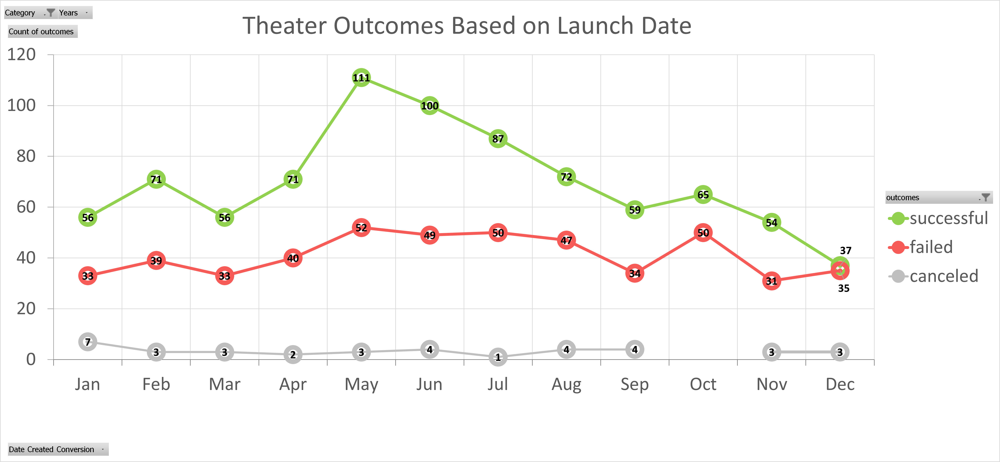
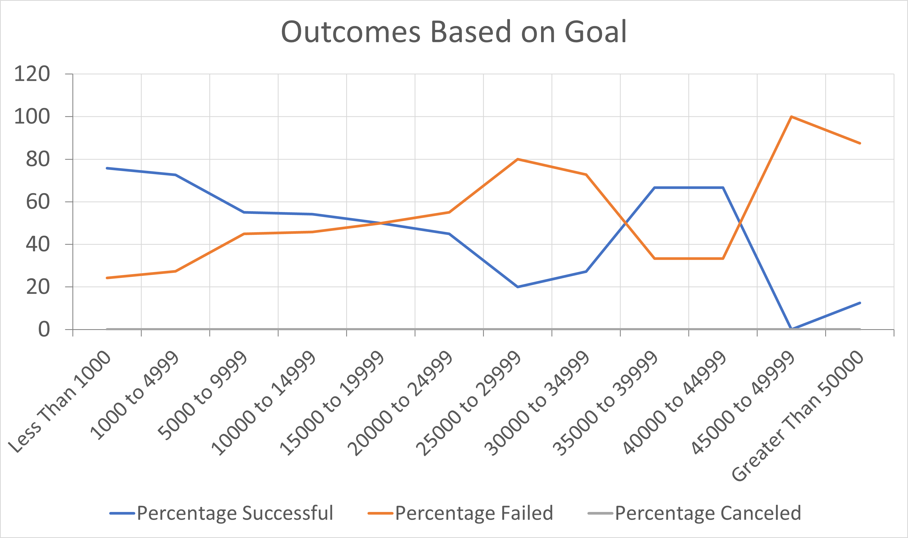

# Kickstarting with Excel

## Overview of Project
In this exercise *Excel* is used to analyze information obtained from [Kickstarter](./data-1-1-3-Kickstarter_Challenge.xlsx), a crowdfunding platform for kickstarting projects. The objective is to reveal trends that define successful guidelines for crowdfunding campaigns.

### Purpose
The purpose is to help our client *Louise* in designing a strategy plan for launching a crowdfunding theatrical play in the U.S., with an estimated cost of $12,000.00 USD.

## Analysis and Challenges
Before starting our analysis, the input data is filtered in order to match our criteria, this is, only those elements categorized as Theater are kept. In this way the results won't be contaminated by data from different categories such as Music, Food, Journalism, etc.

Two data analysis are then performed in order to answer some basic questions:
1. Is there a direct correlation between the launch date and a successful or failed outcome? When is the best time of the year to launch a crowdfunding Theater campaign? 
2. What is the impact of the goal amount when designing a crowdfunding theatrical play? what is the range of goal amount with the highest rate of success?

The main challenge faced during the analysis was to incorporate a "bigger than or equal to" together with a "less than or equal to" conditions to the COUNTIFS function. However, the *SHOW HINT* material and *Google* were very helpful in getting this sorted out.

### Analysis of Outcomes Based on Launch Date
For this analysis, a pivot table based on a worldwide count of successful, failed and canceled crowdfunded theater campaigns against their launch dates is created. Live campaigns were not considered for this analysis.

A pivot table is an important data analysis element because it summarizes relevant information and from it, we can easily generate a visual representation of the results through a data graph or chart.

Since we are dealing with data that vary continuously with time, the results are displayed in a line graph. From the graph it can be observed that May, June and July are the months that span the highest amount of successful theater campaigns being December the least successful month.

February and April are relatively good months to launch a theater campaign. Its rate of successful to failed/canceled projects is relatively high when compared to other months. 

It is advised to avoid launching a theater campaign in January, August, October, November and specially December. These five months display a low rate of success in conjunction with a relatively high rate of failed/canceled campaigns.

### Analysis of Outcomes Based on Goals
This analysis is based in a series of monetary crowdfunding goal ranges and their direct relationship with the success or failure of the theatrical play campaigns worldwide. Live campaigns were not considered for this analysis.

The number of successful, failed and canceled outcomes and their respective percentage with respect to the total events for a specific goal range are summarized in a table and plotted using a line chart.

By visually analyzing the chart is can be observed that campaigns with goals less than $5,000.00 USD have a success rate of above 70%. This percentage drops significantly when the goal ranges between $5,000.00 and $34,999.00 USD.

In fact campaigns with a goal in the range of $15,000.00 to $19,000.00 USD have a 50% probability of success. There is a higher probability of failure than success when the goal ranges between $20,000.00 and $34,999.00 USD. On the other hand, it is particularly interesting to observe how two out of three campaigns with goals between $35,000.00 and $44,999.00 USD were successful. Above this range, the rate of failure is extremely high.

It was also found that the number of backers play an important role in the success of the campaigns. For example, the average number of backers for campaigns with a goal ranging between $35,000.00 and $44,999.00 USD is 288 and the success rate is of 66% while those campaigns with goals between $20,000.00 and $34,000.00 USD have an average of 189 backers per campaign and a low success rate ranging between 20% to 45%.

### Challenges and Difficulties Encountered
As mentioned above, the main challenge faced relates to incorporating a range of values condition to the COUNTIFS function. I reviewed the *SHOW HINT* material along with some videos over the internet to figure this out.

## Results

- What are two conclusions you can draw about the Outcomes based on Launch Date?
1. The most successful time of the year for launching a theater crowdfunding campaign is May-June.
2. It is strongly advised to avoid launching a theater campaign in December. We also recommended to avoid launching in January, August, October and November. 

- What can you conclude about the Outcomes based on Goals?
There seem to be a clear correlation between relatively low goal amounts (below $5,000.00 USD) and the success of a campaign. Another important factor is the number of backers, the more backers there are, the higher the probability of success of a campaign and this is also true for campaigns with higher goal ranges. 

- What are some limitations of this dataset?
Two main limitations were identified. The first one is the lack of sufficient Kickstarter information to conduct a reliable analysis in countries other than the U.S. *Louise* was also interested in mounting a play in the U.K., however the amount of crowdfunded theater plays in that country is limited, for example there are no successful campaigns with goal ranges with goal ranges above $15,000.00 USD.
Another limitation is the lack of up-to-date information. The most recent campaigns analyzed date in 2017. It would be interesting to analyze the impact of COVID-19 in the Kickstarter dataset.  

- What are some other possible tables and/or graphs that we could create?
We discovered that the number of backers is an important factor driving the success of a campaign. We could create a pivot table with the count of backers and analyze their impact in the successful, failed and canceled campaigns. Then we could create a bar chart to visualize the results. 
